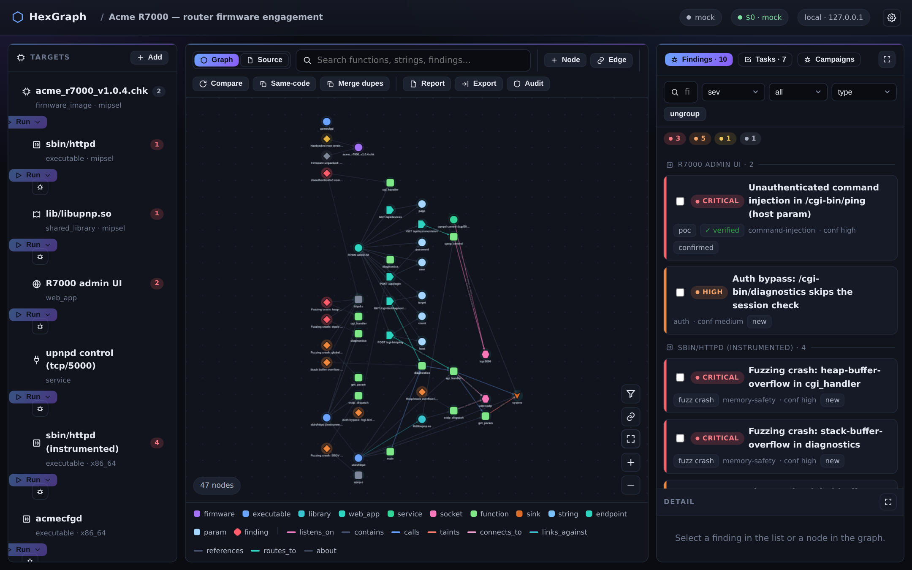

# ⬡ HexGraph

A self-hosted, **local-only** agentic vulnerability-research workbench. Point it at a binary or
firmware image; HexGraph ingests the target, breaks firmware into child targets, runs AI-driven
analysis **using your own model access**, and records every result as a structured **finding** in a
SQLite-backed **typed graph** — targets, functions, sockets, hypotheses, and findings joined by
typed, attributed edges. A loopback-only web UI browses the graph, launches tasks, and triages
findings; the same operations are exposed to a coding agent over MCP.



Three principles are non-negotiable:

- **Local-only.** The API/UI bind to `127.0.0.1`. Nothing calls a HexGraph-operated server; no
  telemetry, no auto-update pings.
- **Bring-your-own-key, or none at all.** Model access is via your Anthropic API key, a local
  Claude Code session, or the built-in **mock** backend. The mock is the default and needs **no key
  and no network** — you can run the entire loop for **$0**.
- **Targets are hostile.** All parsing/unpacking/analysis of target bytes happens inside a disposable
  Docker container with no network and strict resource limits. HexGraph is **static/RE by default**;
  executing the target, reaching the network, or rehosting firmware are each a separate **opt-in,
  policy-gated** capability — and even then run inside that same locked-down sandbox. **The LLM never
  sees raw target bytes** — only tool output (decompilation, strings, imports).

> **Status — pre-1.0.** The core loop works end-to-end (ingest → recon → AI analysis → structured
> finding → graph → spawn follow-up), including real vendor-firmware extraction, cross-binary n-day
> linking, coverage-guided fuzzing, and **verified, executable PoCs** (incl. foreign-arch MIPS/ARM via
> qemu). Expect rough edges. Phase-by-phase status lives in [`PROGRESS.md`](PROGRESS.md).

---

## Install

**Requirements:** Python 3.11+, **Docker** runnable by your user (`docker run --rm hello-world`
works), [`just`](https://just.systems), Linux or macOS. No API key required — the default mock
backend is fully offline.

```bash
git clone <your-fork-or-path> hexgraph && cd hexgraph
just setup          # venv + deps + web UI, then the interactive setup wizard
just serve          # → http://127.0.0.1:8765
```

`just setup` bootstraps the install and launches an **interactive setup wizard** that walks you
through which optional, policy-relaxing features to enable (each shown with its security implication
and an explicit confirmation) and builds the images you chose. The default leaves the **static-only**
posture intact — you opt in to everything else, informed. See **[docs/setup.md](docs/setup.md)** for
the wizard, the manual step-by-step, non-interactive/CI mode, and Ghidra.

> Install `just` without sudo:
> `curl --proto '=https' --tlsv1.2 -sSf https://just.systems/install.sh | bash -s -- --to ~/.local/bin`
> (ensure `~/.local/bin` is on `PATH`), or `snap install just`. Run `just` for the full recipe menu.

---

## The core loop

HexGraph proves one loop: **target → task → structured finding → graph → spawn next task.**

```bash
just demo        # run the whole loop on the bundled targets, offline, $0 — exits 0
```

Or drive it yourself: ingest a target (recon runs automatically and unpacks firmware into child
targets), then launch tasks from the UI and triage the findings they emit.

```bash
.venv/bin/hexgraph ingest tests/fixtures/synthetic_fw.bin --name demo
.venv/bin/hexgraph serve          # → http://127.0.0.1:8765
```

**Two ways to drive it**, both populating the **same graph** and both keeping target bytes in the
sandbox:

1. **The web UI** — pick a target, launch a task (recon / static analysis / RE / pattern sweep /
   harness gen / fuzzing / PoC). HexGraph runs an **agent loop** behind your chosen backend: the
   model requests sandboxed tools (decompile, strings, imports, xrefs, fuzz) and HexGraph executes
   them, looping until it emits findings. You triage results and one-click a suggested follow-up.
2. **A coding agent over MCP** — `hexgraph mcp install` registers HexGraph as an MCP server; Claude
   Code / Codex / gemini-cli then inspects targets and populates the graph autonomously through the
   same sandboxed tools. See **[docs/mcp.md](docs/mcp.md)**.

The model only ever *directs*; HexGraph runs the tools. A plain API key is enough — no external
coding agent is required.

| Backend | Select with | Notes |
|---|---|---|
| `mock` (default) | — | Deterministic, schema-valid findings from fixtures. No key, no network. Dev/CI/`just demo`. |
| `anthropic` | `--backend anthropic` / `HEXGRAPH_LLM_BACKEND=anthropic` | BYOK via `ANTHROPIC_API_KEY` (env or `config.toml`). Real token cost. `pip install -e ".[byok]"`. |
| `claude_code` | `--backend claude_code` | Uses your local `claude` CLI (headless). |

HexGraph **never logs or stores your API key.**

---

## Features

Every capability below the static-only baseline is **off by default** and toggled in **Settings**
(or `hexgraph config set <key> <value>`). Each policy-relaxing one is a separate, explicit opt-in.

| Feature | What it adds | Doc |
|---|---|---|
| **Typed graph + findings** | Targets, functions, sockets, endpoints, hypotheses and findings as typed nodes joined by typed, attributed edges; browse/launch/triage in a three-pane UI. | [graph-ui.md](docs/graph-ui.md) |
| **Verification & the assurance ladder** | Every finding carries an assurance level (`code_present`/`input_reachable` × `static`/`dynamic`); opt-in **PoC verification** executes the target against an unforgeable `{{NONCE}}` oracle (foreign-arch via qemu-user). | [verification-assurance.md](docs/verification-assurance.md) |
| **Fuzzing** | Coverage-guided, surface-aware, campaign-driven (AFL++ / libFuzzer / qemu-mode / boofuzz / desock), detached + crash-safe, with live triage, dedup, minimization, and one-click re-verification. Optional **remote fuzz environments** run a campaign on a beefier host you own. | [fuzzing.md](docs/fuzzing.md) |
| **Build from source** | Compile a managed source tree into an **instrumented, reproducible artifact** via a recorded recipe HexGraph runs in the sandbox; the build→fuzz handoff is automatic. Editable in-browser **Source / IDE tab** with coverage shading. | [build-from-source.md](docs/build-from-source.md) |
| **Dynamic surfaces, rehosting & remote** | Model a running web service or raw-TCP daemon as a first-class **surface**; **rehost** a whole firmware image under full-system emulation; assess a physical **remote** device over SSH/telnet — all with bounded, audited egress. | [dynamic-surfaces-rehosting-remote.md](docs/dynamic-surfaces-rehosting-remote.md) |
| **Coding-agent integration (MCP)** | Drive HexGraph from Claude Code / Codex / gemini-cli, or have HexGraph drive a headless agent (delegate mode) — both restricted to HexGraph's sandboxed tools. | [mcp.md](docs/mcp.md) |

### The opt-in policy tiers, in one sentence

Static-only with `--network none` is the **enforced default**; `features.poc`/`features.fuzzing`
(sandboxed execution), `features.build` (compile a source tree), `features.build_fetch` (a separate
audited, allowlisted dependency fetch), `features.network` (bounded loopback/private egress),
`features.rehost` (full-system emulation), `features.remote` (one authorized live device), and
`features.fuzz_remote` (a user-owned remote compute host) each raise a higher tier behind **its own
gate** — and nothing relaxes anywhere except the single [policy seam](docs/verification-assurance.md).

---

## CLI

`.venv/bin/hexgraph <command>` (or `hexgraph` with the venv active):

```text
hexgraph ingest <path> [--name N] [--project ID] [--no-recon] [--backend B]
hexgraph targets <project>
hexgraph run <target> --type T [--objective TEXT] [--function F] [--backend B] [--mock-scenario S]
hexgraph rehost <target> [--brand HINT]      # boot firmware under emulation (needs features.rehost)
hexgraph findings <project> [--status S] [--export FILE]
hexgraph graph <project> --export FILE
hexgraph config list | get K | set K V       # managed settings + optional-feature toggles
hexgraph mcp [--tools read,write,run] | mcp install [--agent A] | mcp --check
hexgraph serve [--host H] [--port P]          # loopback-only API/UI (default 127.0.0.1:8765)
```

Task types: `recon`, `static_analysis`, `reverse_engineering`, `pattern_sweep`, `harness_generation`
(plus `fuzzing`, `poc`, `agent_delegate` when enabled). For web surfaces: `surface_recon` /
`web_recon`. Full configuration (env vars, `config.toml`, the layering rules) is in
**[docs/setup.md](docs/setup.md)**.

---

## Security model

- **Loopback only.** The server refuses a non-loopback bind unless `HEXGRAPH_I_KNOW_WHAT_IM_DOING=1`.
- **Hostile-target isolation.** Every operation on target bytes runs in a fresh container with
  `--network none`, a read-only root filesystem, a tmpfs scratch, memory/CPU/PID limits, and a
  wall-clock timeout. Only HexGraph's probe scripts run there.
- **Static by default; capability is opt-in and graduated.** Each tier is a separate explicit opt-in
  flipping the single policy seam, and nothing relaxes elsewhere. The same sandbox hardening holds for
  every tier (foreign-arch via qemu-user, never on the host). Full ladder:
  [docs/verification-assurance.md](docs/verification-assurance.md).
- **The LLM never sees raw target bytes** — only tool output.
- **Secrets are never persisted or logged.** Your API key (and SSH / remote-Docker credentials) live
  only in env or `config.toml`, read on demand, reported presence-only.

---

## How it works

Built around clean **seams** — change behavior by swapping behind a seam, never by branching on
backend / tier / executor:

- **`LLMBackend`** — `mock` / `anthropic` / `claude_code` interchangeable; task code never knows which.
- **Executor** — the single container boundary for all target-byte handling (local or remote Docker).
- **Decompiler** — radare2 by default; Ghidra behind the same seam.
- **Rehoster** — full-system firmware emulation; FirmAE (vendor blobs) and qemu+KVM (disk images).
- **Policy** — the one place the static-only invariant is relaxed.

**The Finding is the heart of the product.** Every task and backend emits the same frozen schema
(`src/hexgraph/schemas/finding.schema.json`); `finding_type` (a DB envelope) classifies it for triage.

**Data model** — SQLite via SQLAlchemy (UUID ids), WAL mode so the UI and an agent's MCP server share
it concurrently: `project`, `target` (a self-referential tree of reachable surfaces), `node` (typed
sub-file/conceptual entities), polymorphic **typed, attributed** `edge`, `task`, `finding`. The graph
is relational — **Neo4j is out of scope.** Details in [docs/graph-ui.md](docs/graph-ui.md).

**Bundled test targets** under `tests/fixtures/` (regenerate with `just fixtures`): `vuln_httpd`
(unbounded `strcpy`), `libupnp.so` (a pattern-sweep sibling), and `synthetic_fw.bin` (a squashfs
firmware that unpacks into both). Escalating CVE-class challenge targets live under
`tests/fixtures/challenges/`.

---

## Development

```bash
just                 # list all recipes, grouped
just test            # full suite (mock backend; sandbox/Docker tests auto-skip without the image)
just demo            # the full offline loop, exits 0 — doubles as a smoke test
just ui              # rebuild the SPA (after any frontend/ change)
just showcase --reset && just capture   # regenerate the doc screenshots (see docs/images/README.md)
```

Source is under `src/hexgraph/` (`models/`, `llm/`, `db/`, `sandbox/`, `engine/`, `api/`, `cli.py`,
`mcp_server.py`). See [`CLAUDE.md`](CLAUDE.md) for the working agreement, the seam rule, and the
worktree/PR discipline. Build progress: [`PROGRESS.md`](PROGRESS.md).

---

## Out of scope (by design)

Accounts / multi-user, cloud/hosted compute, exploit *generation*, Neo4j, Kubernetes. Dynamic
execution exists only as the opt-in, policy-gated, sandboxed path described above — never unsandboxed,
never on the host.

---

## License

**[AGPL-3.0](LICENSE).** HexGraph is free and open — use, run, study, and modify it freely. The
copyleft terms mean any modified version you distribute *or offer over a network* must also be released
under the AGPL-3.0, so the project stays open: no closed, proprietary fork. No license gates, no paid
tiers.
