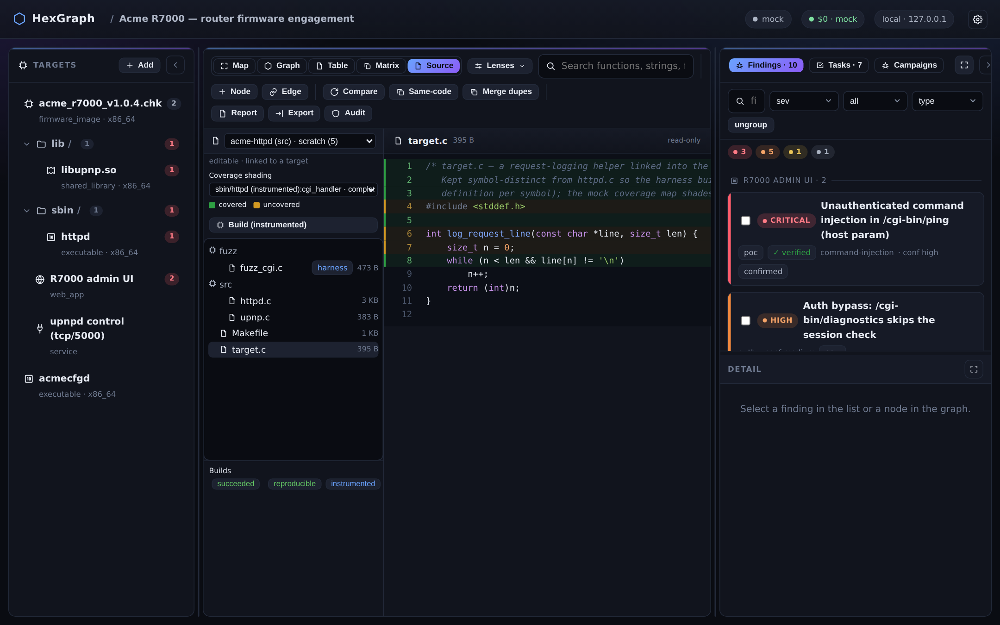
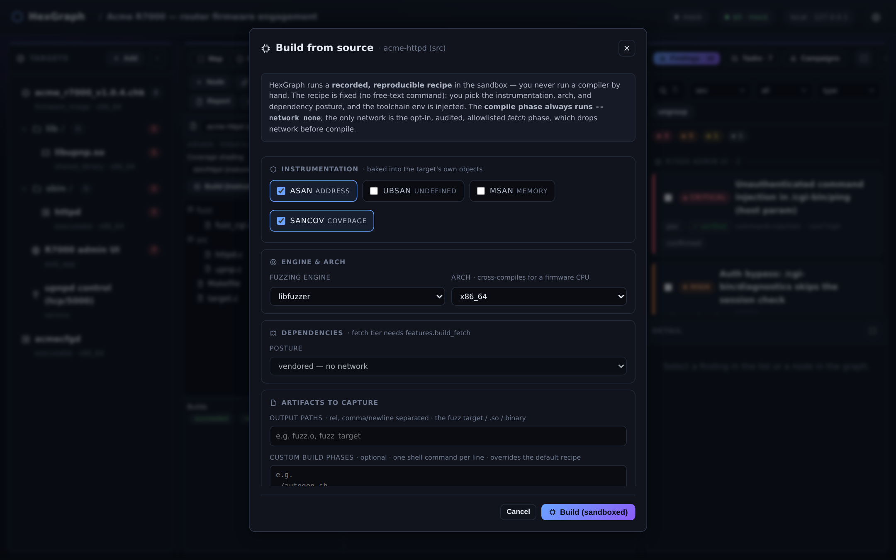

# Build from source & the Source / IDE tab

A project keeps its trusted source separate from its (hostile) targets, lets you browse and edit that
source in an in-browser IDE, and, with `features.build`, compiles it into an instrumented,
reproducible artifact through a recorded recipe HexGraph runs in the sandbox. The design rationale is
in [design/design-fuzzing-and-source.md](design/design-fuzzing-and-source.md).

## Source trees & the Source tab

A **source tree** is either an imported library's source or the harnesses, PoCs, and build scripts
HexGraph itself produces. A tree can be linked to a target through a `built_from` edge, and one project
may hold several trees. The files live on disk under the project's data dir, indexed by a manifest, and
a `source_file` graph node is materialized lazily, only when something references it, so that a tree of
70,000 files never explodes the graph.

The center pane's **Source** mode is the in-browser IDE: a dropdown switches between trees, a file
explorer browses each one, and a code viewer shows a file with line numbers. A finding that maps to
source gets an **Open in source** button that jumps straight to the file and line, and a fuzz crash's
symbolized stack frame jumps the same way.

- **Coverage shading** appears once fuzzing is enabled: pick a campaign and covered lines tint green
  while uncovered lines tint amber, so you can see exactly where the fuzzer is stuck. This is the
  single most useful signal for improving a harness.
- **Harnesses, PoCs, and scripts are all `source_file`s**, role-tagged. A generated harness becomes a
  managed file you can read, and a **Backfill harnesses** action promotes older transient harnesses
  into the same model.
- **The editable IDE** (`features.source.edit`) covers the files HexGraph authors (harnesses, PoCs,
  scripts, and scratch). An **Edit → Save** creates a new revision rather than mutating in place
  (content goes to content-addressed storage, alongside a diff), the file shows its append-only
  revision history with one-click revert, and you can launch a build that rebuilds from a chosen
  revision. Imported, extracted, and vendor source (`origin=git|archive|extracted|upload`) stays
  read-only, since editing it would break the reproducible build's content hash. Firmware-*extracted*
  files are marked `extracted` and treated as untrusted: displayed, but never run or parsed outside
  the sandbox.
- Over **MCP**, the reads are `list_source_trees` and `read_source_file`, and the writes are
  `import_source_tree`, `link_finding_to_source`, and `save_source_revision`.

## Build-as-API (`features.build`)

With `features.build` enabled (`just build-image`), HexGraph compiles a managed tree into an
instrumented artifact through a recorded, reproducible recipe that the API runs in the sandbox. You
never run a compiler by hand.

You author and approve a `BuildSpec`: a `system`, an ordered set of explicit-argv `phases`, an
`instrumentation` profile, the `artifacts` to capture, and non-secret `env`. HexGraph then injects the
toolchain (`CC`, `CXX`, `CFLAGS`, `SANITIZER`, `FUZZING_ENGINE`, all per the base-image contract), so
the same phases can yield an ASan+SanCov build, an AFL++ build, or a plain build just by swapping the
profile.

In the UI, a capability-gated **Build modal** on the Source tab shows a read-only, recorded-recipe
preview (there is no free-text command box) with instrumentation toggles, an arch selector for
cross-compiling, a dependency posture (vendored or fetch), and the injected env plus the `recipe_sha`.
The Builds list shows reproducible, cached, locked, and instrumented badges. Over MCP, the relevant
verbs are `build_target`, `import_oss_fuzz`, `save_source_revision`, `list_builds`, and
`coverage_diff`.

## The build-to-fuzz handoff is automatic

If a tree is `built_from` a target, rebuilding it registers an instrumented derived target (wired up
as `instrumented_build_of` the original), which is the fuzzable twin. The build records the
instrumented target's sources on the derived target (in `metadata_json.fuzz_target_sources`, with the
harness excluded) and promotes any `role=harness` file to a `harnesses` edge, so a later
`start_fuzz_campaign` on the derived target infers `source_lib` and runs coverage-guided with no manual
wiring.

## Reproducibility & the network posture

Reproducibility is the contract. A `recipe_sha`, the source byte-content hash, the toolchain digest,
and a lockfile together make a build replayable. A reproducibility badge shows when all of those are
recorded, and a cache-key hit reuses the prior artifact and skips the rebuild (`SOURCE_DATE_EPOCH` and
ccache make rebuilds both deterministic and incremental).

- **The compile phase always runs `--network none`.** Vendored and offline is the default, and the
  recommendation. Source is mounted read-only, output goes only to `/out`, the process is non-root and
  ephemeral, and a malicious `configure` can burn CPU and exit but cannot persist or exfiltrate.
  Because building runs untrusted third-party code, it has its own fail-closed gate, separate from
  executing the target, so you can build and inspect without ever permitting the binary to run.
- **Bounded dependency fetch (`features.build_fetch`, off by default).** When a build genuinely needs
  to fetch dependencies, enabling this raises a separate, audited, allowlisted fetch phase: a distinct
  sandbox container with the network on but bounded to a registry allowlist (crates.io, pypi.org,
  github.com, a distro mirror, all operator-extendable but never "any host", enforced by an egress
  backstop that drops any off-list connect). It produces a hash-pinned lockfile and an SBOM-lite.
  HexGraph then drops the network and runs the compile `--network none` against the snapshotted deps.
  This is fetch-then-offline, in different containers, so a fetched dep can be recorded but never run
  during the compile. It has its own gate and is never folded into `features.network`.
- **Cross-compiling for firmware** uses `arch` on the recipe, the `WITH_CROSS=1` image, and `just
  build-image with_cross=1`. clang is the cross-compiler: pass a firmware arch (`mips`, `mipsel`,
  `arm`, `armhf`, or `aarch64`) and HexGraph injects `--target=<triple>` along with the parent
  firmware's extracted rootfs as the `--sysroot`, so the instrumented binary is binary-compatible with
  the device userland and runs under qemu-user. If a cross-build fails, it degrades gracefully to
  qemu-mode binary-only fuzzing.
- **Importing an OSS-Fuzz `build.sh`** is supported too. Paste an OSS-Fuzz-style `build.sh` (via `POST
  .../builds/import-oss-fuzz` or the `import_oss_fuzz` MCP tool); it is stored as a `role=script`
  source file, mapped onto HexGraph's `$CC`/`$CXX`/`$CFLAGS`/`$LIB_FUZZING_ENGINE`/`$SRC`/`$OUT`
  contract, and run essentially unchanged through a single shell phase.

A **run-to-run coverage diff** (the `coverage_diff` MCP tool, or
`/api/campaigns/{id}/coverage-diff`) compares two campaigns' per-line coverage and answers the
practical question: what new edges did this run reach? That is how you judge whether a change to a
harness, corpus, or engine actually improved reach.
