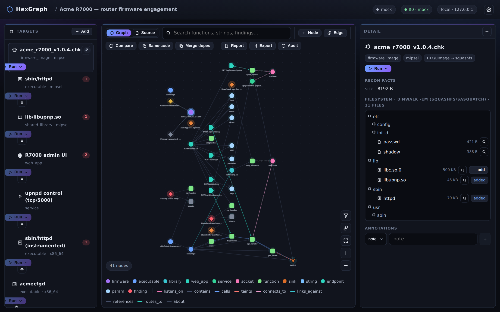
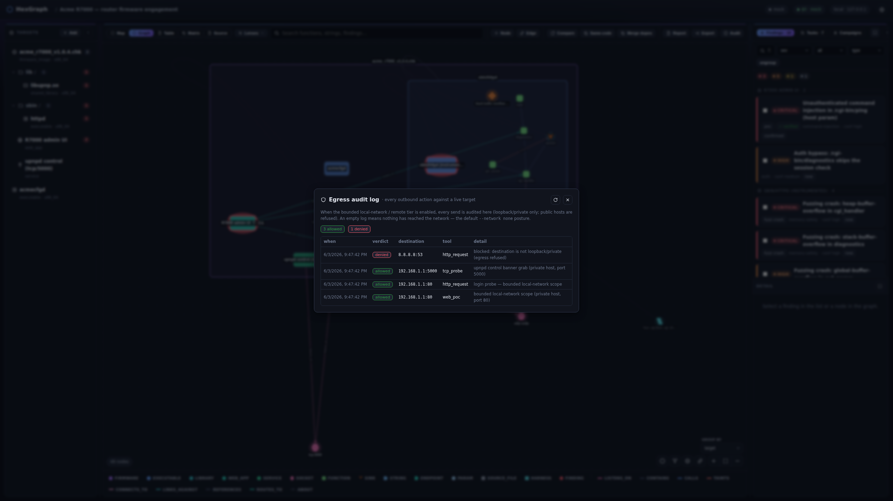

# Dynamic surfaces, firmware rehosting & remote devices

HexGraph treats a target as any reachable surface, not just a file on disk, so a single graph can hold
both the binary you reversed and the live service it serves. The design is written up in
[design/design-dynamic-surfaces.md](design/design-dynamic-surfaces.md) and
[design/design-rehosting.md](design/design-rehosting.md).



## Dynamic web and service surfaces

Alongside byte targets, there are surfaces that hold no bytes of their own.

A **`web_app` target** is a running web surface reached over a Channel (a `base_url`). A
`surface_recon` task materializes a supplied route spec into `endpoint` and `param` nodes offline (no
egress); a `web_discover` task instead crawls the live surface to find routes from links, forms, and a
common-path probe. Either way, where it can identify the code behind a route, it draws a `routes_to`
edge from the endpoint to its handler `function`. That edge is the bridge between the static and
dynamic views.

A **`service` target** is a bare, non-HTTP network service: a bind shell, a vendor binary's control
protocol, a custom daemon, anything reached over a raw TCP or UDP Channel `{kind, host, port}`, with no
bytes and no credentials. You register one with `target_register_service(project_id, host, port,
transport="tcp")` over MCP, or with `POST /api/projects/{id}/targets/service`. It links to the shared
`socket` graph node through a `listens_on` edge, and HexGraph infers the `network` surface from there,
so `fuzz_start` can point boofuzz straight at `host:port` and the matching live tool can probe and prove
it: `net_tcp_request` for a TCP service, `net_udp_request` for a UDP one (the firmware's UDP surface is
often large — infosvr, SSDP, mDNS, DNS, DHCP, WS-Discovery), each paired with a `finding_verify_poc`
spec carrying its transport. Reach for this rather than a `remote`/telnet target when all you have is a
bare protocol, since `remote` carries SSH/telnet shell semantics that a socket service simply does not have.

## Bounded, audited live assessment (`features.network`)

Live assessment is gated by `features.network`, which is off by default. With it on, HexGraph can talk
to the surface through a `net_http_request` tool (with a `session` cookie jar that persists across calls)
and a web-flavored `finding_verify_poc`, whose oracle is the same unforgeable `{{NONCE}}` token used for binary
PoCs, plus `body_contains` and `status` checks.



Egress is bounded. A per-target, deny-by-default allowlist permits only loopback and private hosts,
never a public address, and every outbound request is audited to an `EgressEvent` that you can review
from the **Audit** toolbar button (allowed or denied, the destination, the tool, and the reason).

## Firmware rehosting (`features.rehost`)

Rehosting boots a whole firmware image under full-system emulation and registers the device's live web
UI as a `web_app` child target, so you can reverse the firmware and drive its running web server in
one graph:

```bash
hexgraph config set features.rehost.enabled true    # to boot
hexgraph config set features.network.enabled true   # to then assess the running device
just iotgoat                                         # fetch + rehost + register IoTGoat
# or, by hand:
hexgraph rehost <firmware-target> [--brand <hint>]
```

`rehost` auto-selects the emulator by image type (`select_rehoster`): qemu+KVM for a full-OS disk image
(IoTGoat's x86 OpenWrt `.img`, say), or FirmAE for a vendor blob (squashfs, cramfs, and the like).
Booting needs `features.rehost`; assessing the running device with `web_discover`, `net_http_request`, or
`finding_verify_poc` needs `features.network`. The probe joins the emulator container's netns so it can reach
the device's private IP. Build the rehosting images first with `just firmae-build` (privileged, with
`/dev/net/tun`) or `just qemu-build` (which needs `--device /dev/kvm`).

When the booted device answers on SSH or telnet, rehosting also auto-registers it as a `remote` child
target (pinned to the same emulator netns), so you can drive the live device, not just its extracted
rootfs; using that child still needs `features.remote`. Any other ports it leaves open are recorded for
raw-socket testing with `net_tcp_request`/`net_udp_request` and `finding_verify_poc`.

For a quick guided run, `just vulnrouter` stands up a live vulnrouter web target and a project pointed
at it.

## Remote live devices (`features.remote`)

The live-remote tier (`TIER_LIVE_REMOTE`, with `policy.assert_allows_remote()` and
`remote_scope(host, port)`) covers a physical box on the bench when you have no firmware in hand. A
`remote` target reached over SSH or telnet lets the agent run the same read-only analysis it would on a
rootfs: `net_remote_list_files`, `net_remote_read_file`, and `net_remote_run`, all from a fixed read-only tool
allowlist, with no arbitrary shell. The lone exception is `net_remote_launch`, which starts a service
that didn't auto-start (by binary path plus shell-quoted args) so its socket can be tested live.

Egress is pinned to the single operator-authorized host (and it can be any host, since that is the
operator's responsibility here, unlike the loopback-and-private web tier) and is audited. Credentials
are secrets: read at connect time from the environment (`HEXGRAPH_REMOTE_PASSWORD` or `_KEY`) or from
`config.toml [remote]`, and never stored in the database.
