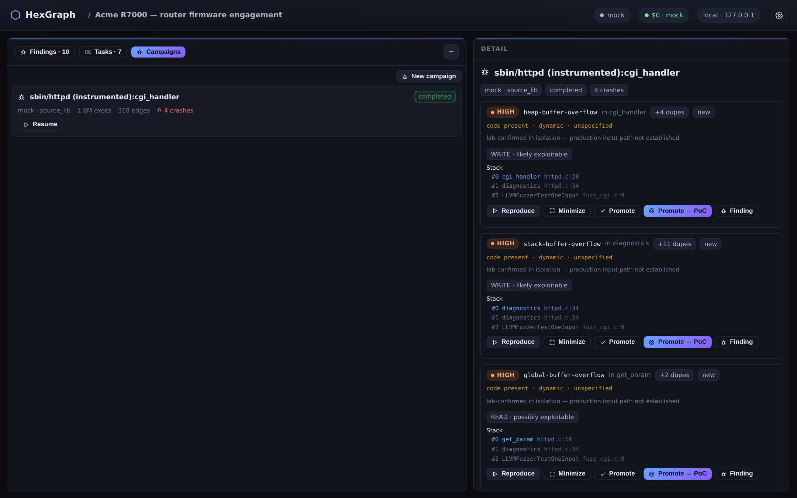
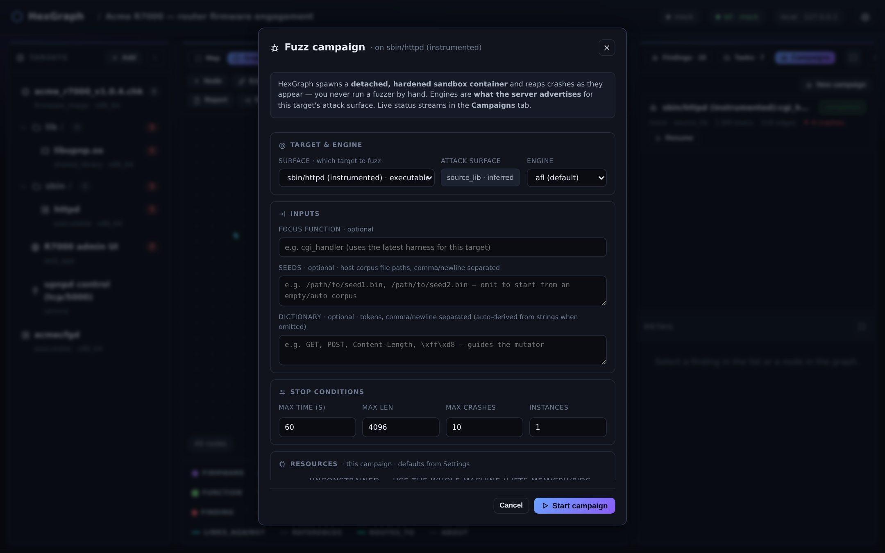
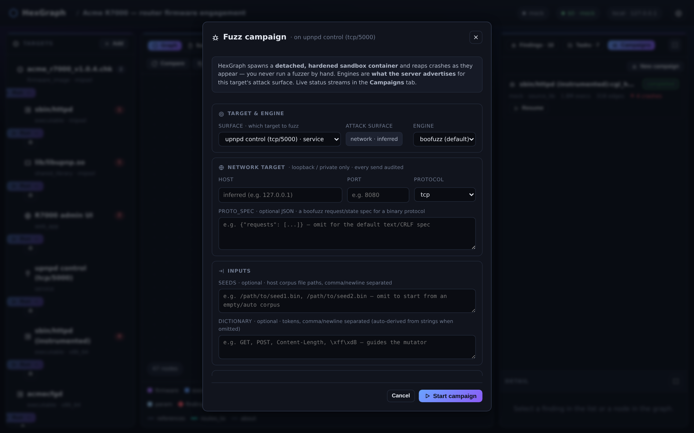
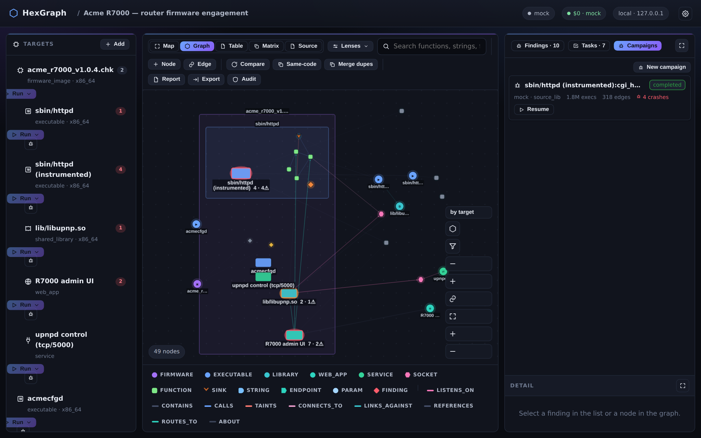

# Fuzzing

The `features.fuzzing` flag adds coverage-guided, surface-aware, campaign-driven fuzzing. Turn it on
with `hexgraph config set features.fuzzing.enabled true` and then `just fuzz-build`, and a
**Campaigns** tab plus a per-target **Fuzz** button appear in the UI. The rationale and the internals
are written up in [design/design-fuzzing-and-source.md](design/design-fuzzing-and-source.md).



## Picking an engine by attack surface

The `Fuzzer` seam chooses the engine by attack surface, and task code never branches on which one it
got:

- A **`source_lib`** target (an instrumented derived target you have source for) goes to **AFL++**,
  with `afl-clang-lto`, CmpLog, and persistent mode, for real coverage.
- A **`binary_only`** target (a stripped ELF with no source) goes to **AFL++ in qemu-mode** (`-Q`,
  full edge coverage through QEMU's TCG), with frida-mode as an opt-in alternative. A foreign-arch
  MIPS or ARM firmware binary runs under qemu-user, with the parent firmware's rootfs supplied as the
  `-L` sysroot. This is the path the verified PoCs run through.
- A **`network`** target (a live or rehosted service) goes to **boofuzz** over a real socket, with
  generational fuzzing. Alternatively, **desock plus AFL++** can coverage-fuzz a *local* server binary
  with `--network none`, using an `LD_PRELOAD` shim that turns its socket into stdin.
- A **`file_format`** target goes to AFL++ or libFuzzer with an auto-derived dictionary.

One honest caveat about the network engine: the one shipped in the image today is a built-in
generational, text-oriented mutator driven by your proto-spec, not the full upstream boofuzz. It works
well, but it's weaker than real boofuzz on binary protocols, because it doesn't yet keep binary length
fields or checksum blocks consistent as it mutates a message. In practice that means you shouldn't
expect it to discover a length/body mismatch on its own. If you're fuzzing a binary, length-prefixed
protocol, pin the framing fields (the lengths and any checksums) in the proto-spec defaults and let
the engine vary the payload around them. (A separate change is bringing the engine closer to upstream
boofuzz.)

The UI never hardcodes the engine list. The Fuzz modal shows whatever engines the server advertises
for the target's surface, fetched from `GET /api/fuzz/engines`.



## Launching a campaign

The Fuzz modal is surface-aware. You pick the target to fuzz (launching from the Campaigns tab
defaults to the best surface, which is an instrumented or live target rather than the raw ingested
root), and the inputs that matter for that surface appear: a network host, port, and protocol with an
optional binary-protocol `proto_spec`; optional seeds (corpus paths); a dictionary (auto-derived when
you leave it blank); a focus function; and the per-campaign `ResourceSpec` (memory, CPUs, PIDs, and an
*unconstrained* toggle), which defaults from your Settings.



Campaigns are detached and crash-safe. Each one launches a hardened `docker run -d` container owned by
a durable `fuzz_campaign` row, and a periodic reaper streams crashes into `fuzz_crash` findings as
they happen, dedups them by a normalized stack hash, minimizes the reproducer, classifies
exploitability, and survives a `serve` restart. Starting, stopping, and resuming a campaign all
preserve the corpus in content-addressed storage.



The Campaigns tab shows a live row per campaign (status, execs per second, edges covered, crash count,
and coverage percentage) over a Server-Sent Events stream, with polling as a fallback, plus Stop and
Resume controls. A campaign that did no work at all (an unreachable service, or zero executions) or
that hit engine instability finalizes in a distinct **`degraded`** state, with an amber warning badge
that explains why. It is never reported as a silent, zero-crash "completed".

## Triaging crashes

Selecting a campaign opens the **Artifacts / triage** view. Crashes are grouped by dedup bucket (one
representative plus a dupe count), and each carries an assurance chip (the ladder, explained in
[verification-assurance.md](verification-assurance.md)), the deterministic exploitability rating, and
a source-mapped stack. The stack frames are symbolized so you can jump to the IDE line: ASan frames
are symbolized at runtime with `llvm-symbolizer`, and a binary-only `abort` is addr2line'd back to its
sink. For each crash you can:

- **Reproduce** or **Minimize**, which re-run the stored reproducer byte-for-byte against the
  instrumented harness binary. This is LLM-free, using the unforgeable `crash` oracle (the MCP verb is
  `verify_fuzz_artifact`).
- **Promote** it to a tracked finding, or **Promote → PoC**, which seeds a reproducer-backed PoC that
  the one-click **Re-verify** path can re-prove on demand.

A binary-only crash climbs to `code_present/dynamic`, meaning it was lab-confirmed in isolation; a
network service-death reaches `input_reachable/dynamic`, meaning it was reached and triggered end to
end through the live input boundary, with its crashing message replaying over the socket. Every entity
is deep-linkable by URL (`?tab=campaigns&campaign=…`), so a triage view is shareable and is restored on
reload.

## A footgun when you author your own harness or target

If you're writing a deliberately-vulnerable target or a custom harness, the compiler can quietly
delete the very bug you meant to plant. HexGraph builds harnesses and instrumented targets with
optimization on, and at those levels clang's dead-store and allocation elimination will throw away a
buffer or an allocation whose result is never observed. A classic example is a `malloc`, a `memcpy`
into it, and a `free`, with nothing in between that ever reads the data: the whole sequence is dead
code to the optimizer, so it vanishes and the fuzzer can run forever without ever hitting the
overflow.

The fix is to make the sink observable. Return the result, print it, or do a `volatile` read of a
byte you wrote, so the write genuinely has to happen and can't be optimized away. One important
gotcha: `-fsanitize=address` does not save you here. ASan instruments the code that survives
optimization; it doesn't force dead code to be kept, so an elided buffer is elided before ASan ever
sees it. When a harness you expect to crash stays stubbornly clean, suspect elision first and add an
observable use of the vulnerable result.

When you're iterating like this on a harness HexGraph authored, note that editing it in place and
rebuilding from the new revision (`save_source_revision`) is gated behind `features.source.edit`,
which is off by default. With it off, the way to iterate is to re-import a fresh source tree each
round rather than editing the managed one. See [build-from-source.md](build-from-source.md) for the
editable-IDE workflow.

## Fuzzing a local network service with launch-and-join

A fuzz container runs on `--network bridge`, and its loopback is the container's own, so it cannot
reach a service bound to the host's bare `127.0.0.1`. For a service HexGraph can start itself (a
launchable server binary), it uses **launch-and-join**: it boots the service in its own hardened
sandbox container and joins the fuzzer to that container's network namespace, so `127.0.0.1:port`
becomes reachable without ever resorting to `--network host`. The isolation holds throughout. Both
containers keep `--cap-drop ALL`, `--no-new-privileges`, `--read-only`, and a non-root user; the
service itself runs `--network none`; the fuzzer reaches it over the shared netns; and every send is
audited.

The service launch rides the PoC/fuzzing exec tier, and the fuzz egress rides `features.network` plus
the bounded local-network tier. To fuzz a service that is *already* running on your host, bind it to a
reachable private address (`192.168.x.x` or `10.x.x.x`, or a container HexGraph can bridge to) and
point the campaign at that host. `--network host` is deliberately never offered, because it would
dissolve the isolation.

## Network fuzzing rides the tier you already have

Binary, source, and desock fuzzing all ride the exec tier (`features.fuzzing`). Network fuzzing rides
the existing local-network tier (`features.network`, bounded to loopback and private addresses, with
every send audited to an `EgressEvent`, and able to join a rehosted device's emulator netns). It is
not a new gate. It composes with rehosting (you can fuzz a rehosted device's service through its
netns) and with remote devices (`features.remote`), though blind network-fuzzing of a physical device
is off by default, loudly warned about, and destructive, so replay or a PoC is usually the better
choice.

## Remote fuzz environments (`features.fuzz_remote`)

Fuzzing is the one genuinely resource-hungry workload here, so a campaign can run on a Docker host you
own instead of on your laptop. A **fuzz environment** is a registered place a campaign's container
runs: `local` (the default) plus however many remote Docker endpoints you add. Because the Builder and
the Fuzzer both call HexGraph's Executor seam, building and fuzzing run on the remote with no change to
the analysis. The `RemoteDockerExecutor` stages the build context and seed corpus to the remote over
`DOCKER_HOST` (content-addressed, through a named volume) and streams crashes, coverage, and stats
back into your local graph.

The trust model keeps the control plane on loopback. The API and UI never leave `127.0.0.1`; the
remote is purely a compute backend you own and explicitly authorize. The same sandbox boundary applies
there: every container on the remote still runs `--network none` (except for the gated net-fuzz tier),
`--cap-drop ALL`, `--no-new-privileges`, `--read-only`, `--user 1000`, and the resource caps, and each
remote launch is audited. Running on a remote is gated only by `features.fuzz_remote`, which is off by
default and fail-closed.

To register one, go to Settings → *Remote fuzz environments* (or `POST /api/fuzz/environments`) and
give it a name, a transport (`ssh` or `tcp`), and a non-secret descriptor. The connection details
themselves are a secret: read at connect time from the environment or `config.toml`, never stored in
the database or logged, and shown only as present or absent.

```bash
# env (preferred) — keyed by the environment id (e.g. id "fuzzbox"):
export HEXGRAPH_FUZZ_REMOTE_FUZZBOX_DOCKER_HOST="ssh://you@beefybox"     # SSH control socket
# or tcp:// + TLS client certs:
#   HEXGRAPH_FUZZ_REMOTE_FUZZBOX_DOCKER_HOST="tcp://10.0.0.5:2376"
#   HEXGRAPH_FUZZ_REMOTE_FUZZBOX_TLS_VERIFY=1   HEXGRAPH_FUZZ_REMOTE_FUZZBOX_CERT_PATH=~/.docker/fuzzbox
hexgraph config set features.fuzz_remote.enabled true
```
```toml
# …or config.toml
[fuzz_remote.fuzzbox]
docker_host = "ssh://you@beefybox"
```

A one-click **Health-check** confirms the endpoint is reachable and authorized and has the
`hexgraph-fuzz` image present. After that, pick the environment in the Fuzz modal (it defaults to
`local`), or pass `environment` to `start_fuzz_campaign` over MCP or to the campaign API. Each
environment carries its own `ResourceSpec` ceiling, which the campaign inherits.
