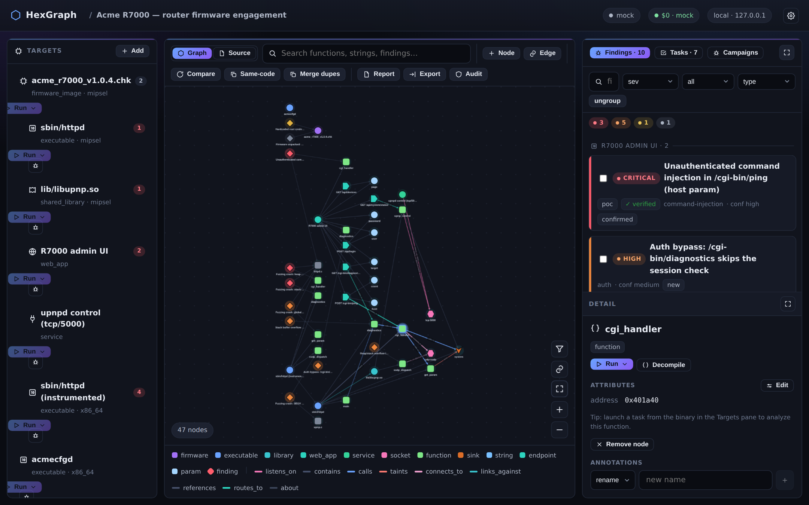
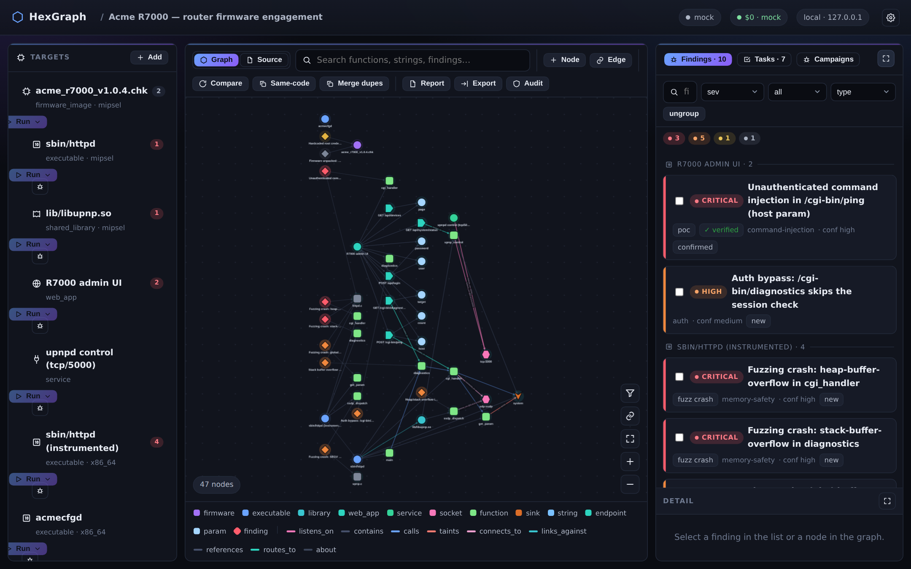

# The typed graph & web UI

HexGraph records every analysis result in a SQLite-backed **typed graph** and browses it through a
loopback-only three-pane web UI (`hexgraph serve` → http://127.0.0.1:8765).

## The three panes

- **Left — target tree.** The ingested target and any firmware children. Each row has a launcher:
  pick a **task type** and (for the mock) a **scenario**, then **Run**. Firmware targets show a
  browsable unpacked filesystem; any file can be added as a child target.
- **Center — graph ⇆ source.** A segmented control switches between the **Graph** (targets,
  functions, sockets, hypotheses, harnesses, and findings as typed nodes, joined by typed edges —
  `contains` / `calls` / `taints` / `listens_on` / `built_from` / `located_in` / `harnesses` / … ;
  rendered offline with Cytoscape.js) and a **Source** view (the in-browser IDE — see
  [build-from-source.md](build-from-source.md)). Click an edge to see its attributes (call sites,
  ports, addresses).
- **Right — findings.** Every finding, typed (vulnerability / poc / recon / harness / fuzz_crash / …)
  and filterable; click one for its evidence, reasoning, verification, and suggested follow-ups.

Selecting a node lights its connected edges and opens the inspector (decompile / annotate / run a
task). Click a finding's **suggested follow-up** to open a pre-filled launch modal for the next task;
use **Confirm / Dismiss** to triage. The **Add node / Add edge** tools author functions, sockets,
hypotheses, and typed edges by hand.

**Removing things is reversible by default.** Archive a node or a whole target subtree to declutter
the graph (re-adding the same entity restores it); individual edges and whole projects are hard
deletes. **Merge dupes** folds duplicate functions/strings/targets into one keeper (also run
automatically after LLM tasks).

## Firmware unpacked filesystem

Firmware targets persist their extracted rootfs (`metadata_json["filesystem"]`, files on disk under
the project data dir). The detail panel browses it; any file can be promoted to a child target.

Extraction (in the sandbox) handles bare squashfs (sasquatch / unsquashfs), cpio, partitioned full-OS
disk images (The Sleuth Kit), and wrapped vendor firmware (binwalk recursive → jefferson / ubi_reader
/ sasquatch for nested JFFS2 / UBIFS / cramfs).

## Data model

SQLite via SQLAlchemy, UUID ids, **WAL mode** so the UI and an agent's MCP server (separate
processes) share the DB concurrently. Foreign-key enforcement is deliberately off — edges/annotations
are polymorphic string refs, not FKs.

- **`project`**, **`target`** — a self-referential `parent_id` tree. A target is a *reachable surface*:
  a byte target with a `path`, or a dynamic `web_app` / `service` surface reached via a Channel in
  `metadata_json` (see [dynamic-surfaces-rehosting-remote.md](dynamic-surfaces-rehosting-remote.md)).
- **`node`** — typed sub-file / conceptual entities: `function`, `symbol`, `string`, `struct`,
  `hypothesis`, `pattern`, `input`, `sink`, **`socket`** (a network/IPC endpoint shared across
  binaries — identity is `(project, kind, port|name)`, so a server `listens_on` it and a client
  `connects_to` it resolve to one node), `endpoint`, `param`, `source_file`. `NodeType` is a String
  column, so new vocab is zero-migration.
- **`edge`** — one polymorphic, **typed, attributed** relationship between any two entities
  (target | node | finding | task): `contains`, `links_against`, `calls`, `reads`/`writes`, `taints`,
  `bypasses`, `listens_on`/`connects_to`, `routes_to` (route→handler), `similar_to`, `derived_from`,
  `about`, … Edges carry type-specific attributes (`engine/edge_schemas.py` is the registry of what's
  meaningful per type — a `calls` edge's `call_sites`/`arg_constraints`, a `listens_on` edge's
  `address`/`backlog`). It's guidance, not a hard schema: unknown keys pass, but **list attributes
  merge as sets** so repeated edges accumulate `call_sites` rather than clobber.
- **`task`**, **`finding`** — `task.status` is an Enum; `finding.status` is a plain String.

The graph is relational — **Neo4j is out of scope.** Node identity for functions/symbols/structs is
the *normalized* name within a target (decompiler prefixes stripped, so `sym.get_param` == `get_param`).

## The Finding schema is frozen

Every task and backend (mock included) emits exactly the shape in
`src/hexgraph/schemas/finding.schema.json` (shipped in-package); a contract test enforces it. New
structure goes in the DB envelope (e.g. `finding_type`, `evidence.extra`), never in the frozen schema.
`finding_type` (`vulnerability | recon | harness | fuzz_crash | poc | annotation | other`, classified
from the producing task) drives sort/filter in the findings panel.

## Mock scenarios

On the mock backend, the launcher offers scenarios on `sbin/httpd`:
`static_analysis/critical_overflow` (critical overflow + `related_to` edge to `libupnp.so`),
`/no_findings`, `/malformed_then_valid` (JSON-repair retry), `reverse_engineering`, `pattern_sweep`
(sibling match), `error_rate_limit` / `error_timeout` (graceful failure), and a default
always-success scenario. See [mock-llm-provider.md](mock-llm-provider.md) for the three fidelity
layers and the contract test.
