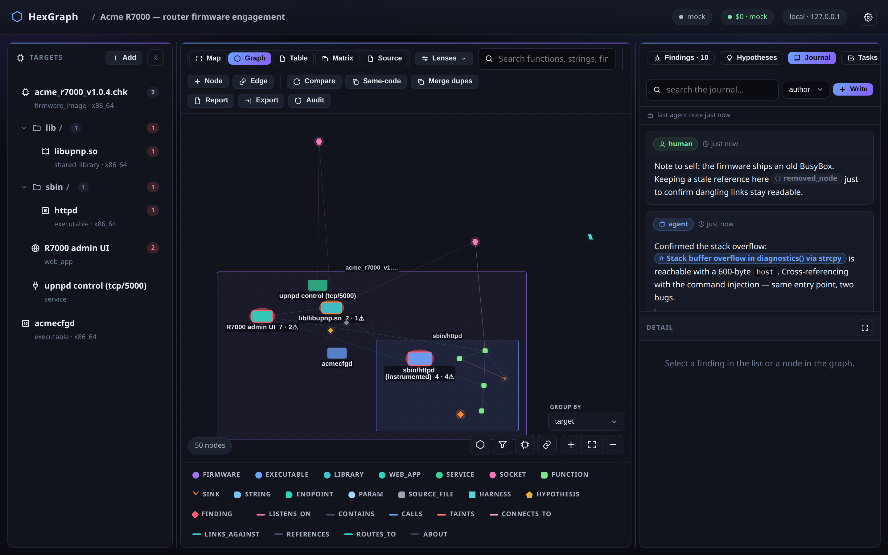

# The research journal

The graph, the findings, and the tool-result store are very good at recording *facts*. They are poor
at recording *story*. Come back to a project after a week, or resume an agent in a fresh session, and
nothing tells you where you were, what you believed, or which dead ends are already burned. That
context normally lives only in your head, and it evaporates between sessions.

The journal is the place for it. It is a freeform, timestamped markdown notebook, scoped to a project,
that you and the agent share. Each entry is attributed to a human or an agent and answers four loose
prompts: what idea you had, what you tried, what worked or didn't, and what you learned. It sits in the
right pane under its own **Journal** tab, alongside Findings, Hypotheses, and Tasks. Think of the
journal and the hypotheses worklist as two halves of one thing, your research notebook: the open
questions you are chasing, and the narrative of how you chased them.

## The timeline

Entries appear newest first, one per card. Each card carries an author badge, so a human note and an
agent's session log are legible apart at a glance, a relative timestamp, an "edited" marker when the
entry has been changed, and the body rendered as markdown. A small line above the list tells you how
long it has been since the agent last wrote anything, which is a quiet but useful trust signal when an
agent has been working on its own.

You can filter the timeline by author, or search the full text of every entry. The search is the
single most valuable thing the journal does for an agent: a later session can ask "what did I try on
the CGI handler" and re-orient in one call instead of re-deriving everything from scratch.

## Writing an entry

Click **Write** and a lean composer appears. It is deliberately not a heavyweight WYSIWYG editor; it
is a markdown source box with a live **Preview** toggle, and it only shows up while you are actually
writing, so it never eats panel space when idle. Write your note in markdown, preview it if you like,
and add it (or press Cmd/Ctrl+Enter). Anything you write from the web UI is a human entry, because the
web UI is your own workbench. The agent writes its own entries through its tools, and a completed
analysis task leaves a closing session-log entry automatically.

Every entry is editable and deletable from here, whether you or an agent wrote it, because it is your
notebook to curate. Editing reopens the composer in place and marks the entry as edited. (The agent
plays by a stricter rule on its side: through its own tools it may add entries and touch only the ones
it authored, never your words.)

## Mentioning the graph

The reason the journal isn't just a text file is that an entry can point at the things it talks about.
Type `@` while composing and a small popover opens right at your cursor, searching your targets,
functions and other nodes, findings, and hypotheses as you type. Pick a result and it drops a mention
into your note. In the rendered entry that mention becomes a clickable chip: click it and HexGraph
selects that object for you, opening a finding's inspector or focusing a node, target, or hypothesis in
the graph.

Mentions stay readable even when the graph moves underneath them. HexGraph merges duplicate objects
and lets you archive things, so a reference saved months ago could easily point at something that no
longer exists where it used to. The journal resolves every mention when it renders, following a merge
to its keeper, and when an object really is gone it shows the mention greyed out and struck through
rather than breaking. A dead reference is obvious, but it never crashes the page or loses the
surrounding note.

Because an agent may quote a string it pulled straight out of a hostile firmware image into an entry,
every entry, yours included, is rendered through a strict sanitizer with no raw HTML. The markdown you
see is always safe to read.

## The narrative trail

The loop closes in the detail panes. Open a finding, a node, or a hypothesis, and near the bottom of
its detail you will find an **In the journal** section listing the entries that mention it. Reading a
hypothesis, you can see the trail of notes that worked it; reading a finding, you can see how it came
to be. The section simply isn't there when nothing mentions the object, so it never adds noise.

## How this fits the agent

None of this depends on you writing diligently. When an analysis task finishes, HexGraph drafts a
closing journal entry for it from the tool-call trace, and the agent fills in the narrative, the same
way a task is required to emit its structured findings. The agent is also reminded as it works to write
at each pivot and dead end, not only at the very end. The full set of journal tools an agent uses, and
the discipline behind keeping the notebook current, is described in [docs/mcp.md](mcp.md).
