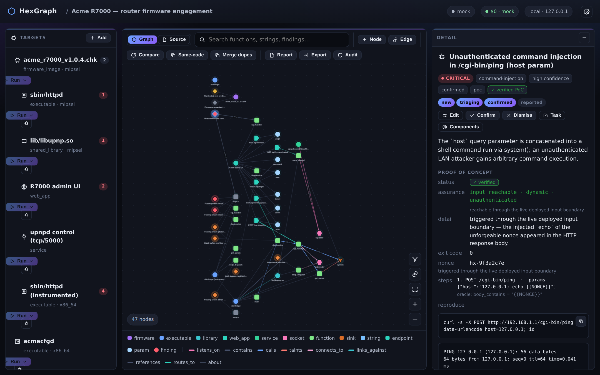

# Verification, the assurance ladder & the policy model

A HexGraph finding is more than a claim — it carries an **assurance level** that says *how well
established* it is, and (when you opt in) HexGraph can **execute the target** to prove it against an
unforgeable oracle.



## The assurance ladder

Every finding's evidence records a two-standards ladder — a **standard** × a **method**:

| | `static` (argued) | `dynamic` (observed) |
|---|---|---|
| **`code_present`** | the vulnerable code is present (the floor) | lab-confirmed in isolation — the bug fires, input path not yet established |
| **`input_reachable`** | a source→sink path is argued over the typed graph | reached **and** triggered end-to-end through the live input boundary |

An optional access qualifier (`unauthenticated` / `authenticated` / …) sharpens it. The UI renders
this as an **assurance chip** on every finding and crash; green marks reachability through the live
boundary. The four rungs let you sort a backlog by how real each claim is, rather than treating a
static guess and a verified PoC as equals.

The design rationale and the full oracle taxonomy live in
[design-verification-oracles.md](design-verification-oracles.md).

## PoC verification (`features.poc`)

With **PoC verification** enabled, the `poc` task and the `verify_poc` MCP tool **execute the
target** in the sandbox with an attacker input and confirm exploitation via an unforgeable
`{{NONCE}}` oracle: HexGraph substitutes a fresh random token, runs the PoC, and "verified" means the
injected behaviour really happened (the nonce appeared in output the target had to *produce*). A
confirmed PoC is surfaced as a `verified` finding.

```bash
hexgraph config set features.poc.enabled true     # flips the policy to allow sandboxed execution
# then launch a `poc` task from the UI Run menu, or over MCP:
#   verify_poc(target_id, poc, finding_id=...)  with a spec like
#   {"stdin": "...{{NONCE}}...", "oracle": {"type": "output_contains", "value": "{{NONCE}}"}}
```

**Foreign-arch targets run under qemu-user** automatically: `poc_probe` picks `qemu-<arch>` from the
ELF header and `verify_poc` mounts the parent firmware's extracted rootfs as the qemu sysroot (`-L`),
so a dynamically-linked MIPS/ARM/… binary finds its libs (verified end-to-end on real MIPS firmware).
Beyond command-injection, the oracle set includes `callback`, `canary_read`, `oob_write`, and a DoS
`liveness`/`unavailable` oracle, plus a web-flavoured `verify_poc` (`body_contains` / `status`).

## The graduated, opt-in policy model

Static-only is the **enforced default, not an absolute ban**. Each capability tier is a separate,
explicit opt-in that flips the single **policy seam** (`policy.current_policy()` /
`assert_allows_*`), and **nothing relaxes anywhere else**. The same sandbox hardening
(`--network none` baseline, read-only root, capped, timed, non-root, foreign-arch via qemu-user)
holds for every tier — never on the host.

- **static-only** (default) — no execution, `--network none`.
- **build from source** — `features.build` permits compiling a source tree into an instrumented
  artifact in the same `--network none`, capped, RO-source, non-root sandbox (`assert_allows_build`);
  a sub-capability of sandboxed-exec but its own gate, so you can build-and-inspect *without*
  permitting the target to run. See [build-from-source.md](build-from-source.md).
- **bounded dependency fetch** — `features.build_fetch` (its own fail-closed gate,
  `assert_allows_build_fetch`; *never* `features.network`) raises a separate, audited, **allowlisted**
  fetch phase, then drops the network and compiles `--network none` — fetch-then-offline.
- **sandboxed execution** — `features.poc` / `features.fuzzing` allow running the target inside the
  same capped, timed, `--network none` sandbox (foreign-arch via qemu-user). See
  [fuzzing.md](fuzzing.md).
- **bounded local-network** — `features.network` permits egress only to loopback/private hosts via a
  **per-target deny-all-but-this allowlist** (no public addresses), every request audited to an
  `EgressEvent`. See [dynamic-surfaces-rehosting-remote.md](dynamic-surfaces-rehosting-remote.md).
- **rehost** — `assert_allows_rehost` boots a firmware image under full-system emulation.
- **remote** — `assert_allows_remote` reaches one operator-authorized live device over SSH/telnet.
- **remote fuzz environment** — `assert_allows_fuzz_remote` lets a campaign's container run on a
  *user-owned* remote Docker host. This governs **where** compute runs, not **what** the sandbox may
  do — the same hardening applies on the remote and the control plane stays loopback.


Resource ceilings (the `ResourceSpec` / `unconstrained` knob) are **never** a policy relaxation —
they only lift mem/cpu/pids, never a security flag. The editable IDE is likewise confined and
reversible: only HexGraph-authored files are editable, an edit creates a new content-addressed
revision, and imported/extracted/vendor source stays read-only.
